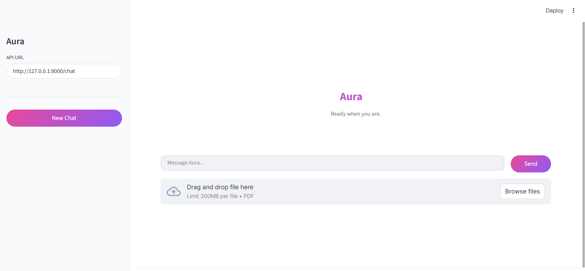
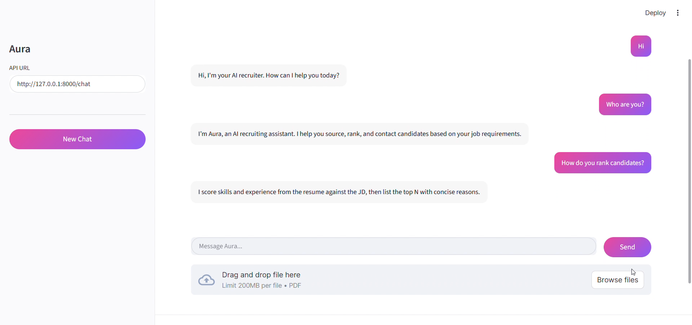
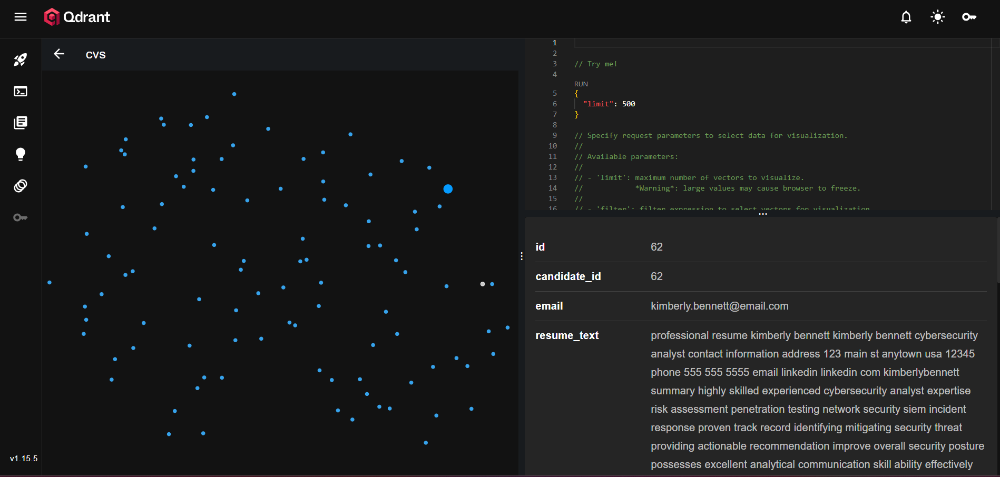

<div align="center">
<h1>Aura – AI Recruiter Agent</h1>
<p><strong>Source, rank, explain and contact top candidates from your own CV / resume datastore.</strong></p>
<p>Streamlit UI · FastAPI backend · Qdrant vector search · BERT embeddings · Ollama LLM (optional) · SMTP scheduling & outreach</p>
</div>

---

## 1. Overview
Aura is an AI recruiting assistant that ingests / indexes cleaned resumes (CVs), then lets you:
- Provide a job description (paste or PDF upload)
- Retrieve and rank the top N matching candidates
- Generate concise skill/experience/achievement rationales (2–3 sentences)
- Schedule interview slots and send invitation emails
- Ask built‑in FAQ questions (“Who are you?”, “What can you do?”, etc.)


---

## 2. Features
| Area | Capability |
| Job Description | Text input or PDF upload (auto‑clean & embed) |
| Email Outreach | SMTP invites with interview scheduling |

## Screenshots & Examples
You can add illustrative images in the `images/` folder. Suggested filenames:
| Purpose | File |
|---------|------|
| Main UI (chat + input bar) | `./images/aura_newChat.png` |
| FAQ | `./images/1113.png` |
| Candidate list example | `./images/1113(1).png` |
| Qdrant DB | `./images/qdrant.png` |

Embed them once added:
```markdown


.png)

```

## Architecture Diagram
```markdown

```


---

## 3. Architecture
```
Streamlit (UI)  -->  FastAPI /chat
					    |
					    v
				 RecruiterAgent (intent, formatting, FAQ)
					    |
				  Agent Graph (retrieve -> analyze -> skills -> rank -> explain)
					    |
				    Qdrant (vectors + payload email/name)
					    |
				   BERT Embeddings (transformers)
					    |
				    Ollama LLM (phi3 or configured) [optional]
					    |
					SMTP (invite emails)
```
Key files:
- `src/app.py` – Streamlit interface
- `src/api.py` – FastAPI endpoints (`/chat`)
- `src/llm_agent.py` – Intent detection, FAQ, formatting
- `src/agentGraph.py` – LangGraph‑style pipeline + scheduling, emailing
- `src/agentNodes.py` – Low‑level nodes (analyze, rank, explain)
- `src/storage.py` – Qdrant storage abstraction
- `src/embeddings.py` – BERT embedding generation
- `src/mailer.py` – SMTP send utility

---

## 4. Quick Start (Windows / PowerShell)
```powershell
# 1. Create & activate virtual environment
python -m venv venv
./venv/Scripts/Activate.ps1

# 2. Install dependencies
pip install -r requirements.txt

# 3. Run backend API
uvicorn src.api:app --reload --port 8000

# 4. In separate shell start Streamlit UI
cd src
streamlit run app.py
```
Open UI at http://localhost:8501 and API at http://localhost:8000/docs (Swagger).

---

## 5. Environment Variables
Set in PowerShell (session) before starting services:
```powershell
$env:API_URL = "http://127.0.0.1:8000/chat"            # Frontend API base
$env:OLLAMA_HOST = "http://localhost:11434"            # Ollama server
$env:OLLAMA_MODEL = "phi3"                              # Or fast model (phi3:mini, llama3.2:1b-instruct)
$env:CHAT_TOP_K = "3"                                   # Default results in chat
$env:EXPLAIN_WITH_LLM = "1"                            # Set "0" to skip LLM explanations (fast mode)
$env:RERANK_LOCALLY = "0"                               # Set "1" to fetch vectors & cosine rerank
$env:LLM_NUM_PREDICT = "128"                            # Limit tokens for faster generation
$env:MAX_RESUME_CHARS = "1200"                          # Prompt truncation
$env:MAX_JOB_CHARS = "800"                              # Prompt truncation

# SMTP (Gmail example – use App Password)
$env:SMTP_HOST = "smtp.gmail.com"
$env:SMTP_PORT = "587"
$env:SMTP_USER = "your_email@gmail.com"
$env:SMTP_PASS = "your_16char_app_password"            # NEVER commit this
$env:FROM_EMAIL = "your_email@gmail.com"
$env:REPLY_TO = "your_email@gmail.com"
$env:EMAIL_DRY_RUN = "1"                               # Set "0" to actually send
```
Persistent (across sessions) alternative: `setx VAR "value"` (then restart shell).

---

## 6. Usage Flow
1. Launch Streamlit & API.
2. Paste or upload a PDF job description.
3. Ask: “Find top 3 candidates for this JD.”
4. Review concise candidate list (name‑first, 2–3 sentences, score).
5. Request scheduling: “Book appointments and send them emails.”
   - Response (configured to concise format): `Scheduled and attempted emails for N candidates.`
6. Ask built‑in FAQs any time (“Who are you?”, “What can you do?”, etc.).

---


Other tips:
- Pre‑embed & store resume email in Qdrant payload (run main notebook cells).
- Keep BERT model on GPU if available (transformers auto‑detect). 


---

Enjoy recruiting with Aura! 🚀
